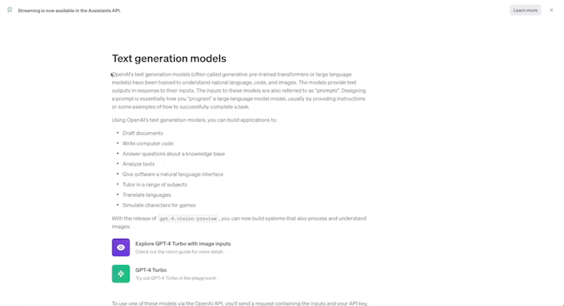
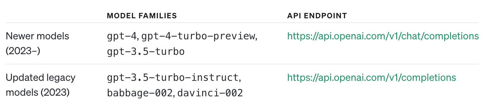

GPT-Translator-Shortcuts——适用于MacOS/IOS/iPadOS的AI翻译工具。

不想打开三方软件？嫌三方软件占用内存过多？想拥有更好的翻译体验？那么不如试试GPT-Translator-Shortcuts！
## 1. 易于使用
你只需使用鼠标选中文本，然后按下Ctrl+T（可以根据自己的偏好，设置对应的快捷键），就会触发快捷指令，完成翻译。

## 2. 配置说明

### 2.1. MacOS
1. 复制下方的链接到浏览器内，然后获取快捷指令。
https://www.icloud.com/shortcuts/7b9a90d2ff134bd3bbb46cf74e92bb96
2. 然后在你的电脑中打开快捷指令，然后找到GPT-Translator-Mac。接下来你需要修改一些配置。

3. 在文本中，你需要替换自己的OpenAI GPT-3.5的token。
4. 在获取https://openapi.xty.app/v1/chat/completions内容中，你需要根据自己购买的token决定，如果你购买的是第三方代理，那么你只需更换https://openapi.xty.app为对应的代理地址即可。如果你使用的是官方token，你可以按照官方提示更改：

5. 下面开始测试吧！
### 2.2. iPadOS
- [ ] TODO
### 2.3. IOS
- [ ] TODO
